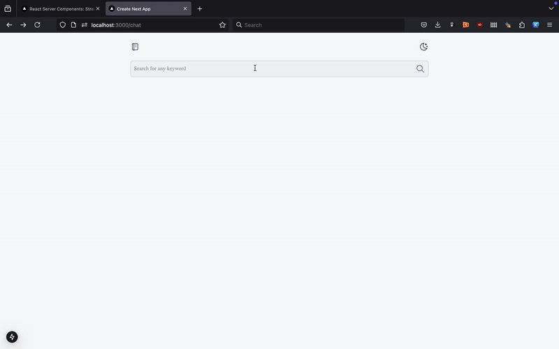

## Demo

I have used a local Large Language Model (hereafter referred to as an LLM) to provide the user with the basic translation.

Then, I'm extracting the word guessed by the LLM to call a free dictionary API to get a full definition of the English term.

## Backstory

To learn more about civilizations and hopefully more about myself, I read Genesis (from the Bible) a long time ago. I was always interested in the Bhagavad Gita as a source of wisdom and philosophy, but never picked it up.

Watching Oppenheimer last year pushed me to finally take the plunge and start reading it. The quote everyone knows by now, piqued my interest.

I purchased a Hindi version of the Bhagavad Gita to be closer to the original Sanskrit version and not be heavily influenced by the English language when it came to distilling ideas difficult to accurately translate and condense.

This posed a new challenge: My Hindi isn't the greatest, and I'm much slower at reading and writing Hindi compared to speaking the language. 

I have always used the latin alphabet to write Hindi when chatting with friends.

To make it much easier to learn Hindi words quickly, I decided to make an app which uses the power of generative AI to provide me the meanings of words directly from the romanized version of the Hindi word.

I then use an API to fetch the definition of the top English word which is synonymous to the Hindi word.

## Future plans

The plan is to extend this to have a full Hindi dictionary entry of the word searched, and have the English word follow after.

Right now, I couldn't find a hindi dictionary with a permissive license.

## Tools used
### Ollama
https://ollama.com/

Ollama can be used to serve LLMs locally. I'm using the Ollama docker container to containerize the model and simplify deployment.

You could run it directly on your machine to achieve a small performance improvement over the docker container.

### Llama 3.2 3B token model
https://ollama.com/library/llama3.2:3b

https://www.llama.com/llama-downloads/

You'll need permission to use the models.

### ReactJS + NextJS
https://nextjs.org/

Next JS for the frontend to make a quality single-page-application (SPA).

## References and Further Reading
1. Course: Foundations of Local Large Language models by Duke University <https://www.coursera.org/learn/local-large-language-models/>
2. Ollama <https://github.com/ollama/ollama?tab=readme-ov-file#ollama>
3. Free Dictionary API <https://github.com/meetDeveloper/freeDictionaryAPI>
4. Indic transliteration tools <https://github.com/indic-transliteration/indic_transliteration_py?tab=readme-ov-file#indic-transliteration-tools>
5. FreeDict <https://freedict.org/downloads/#dictionary-downloads>
